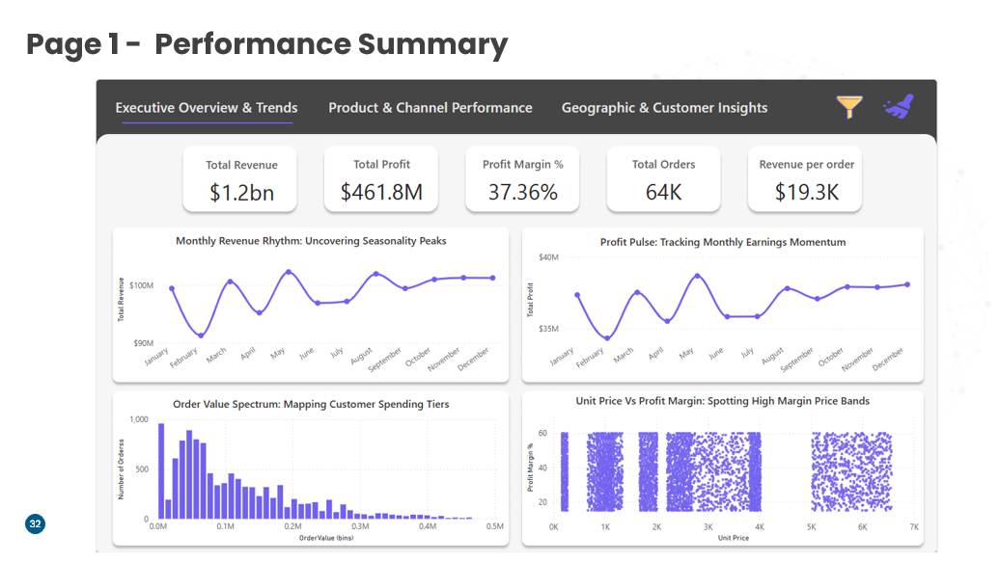
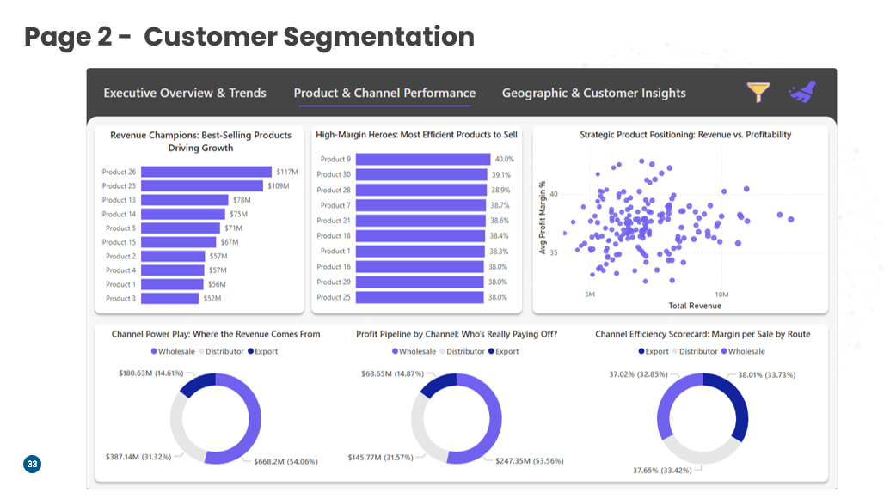
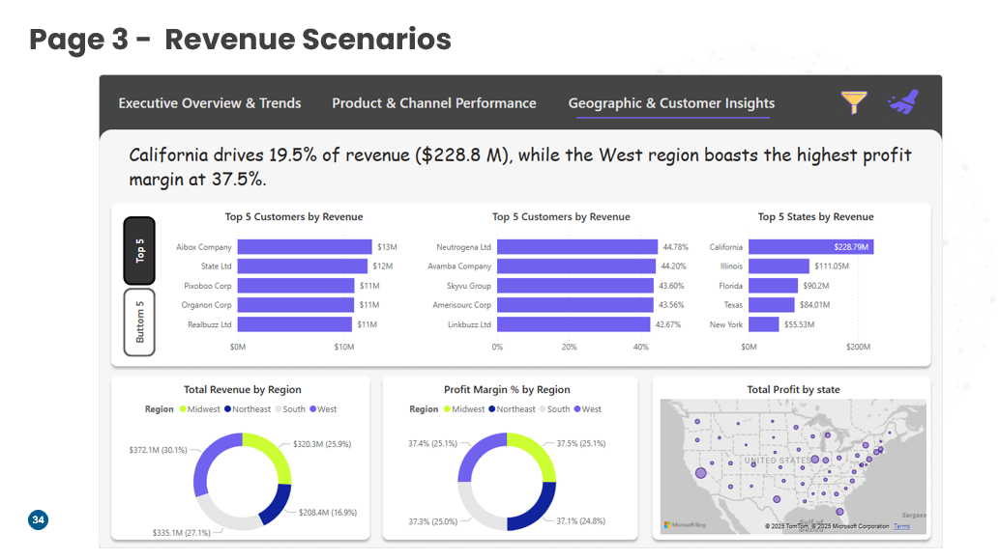

---

## 🖼 Dashboard Screenshots

### 📌 Page 1 – Performance Summary

### 📌 Page 2 – Product & Channel Performance

### 📌 Page 3 – Geographic & Customer Insights

---

## 📊 Key Dashboard Pages

### 1️⃣ Performance Summary
- Total Revenue  
- Total Profit  
- Profit Margin %  
- Total Orders  
- Revenue per Order  
- Monthly Revenue Trend  
- Monthly Profit Trend  
- Order Value Distribution  
- Unit Price vs Profit Margin  

### 2️⃣ Product & Channel Performance
- Best performing products  
- Revenue by sales channel  
- Profit contribution analysis  

### 3️⃣ Geographic & Customer Insights
- Top States by Revenue  
- Top Customers by Revenue  
- Revenue & Profit by Region  
- Profit Margin % by Region  
- Geographic profit visualization using maps  

---

## 📂 Excel Sheet
The Excel file in this repository includes:
- Raw transactional data  
- Cleaned and transformed datasets  
- Pivot tables  
- Calculated KPIs  
- Interactive dashboards  

---

## 🛠 Tools & Techniques Used
- **Microsoft Excel**
  - Power Query for data cleaning  
  - Pivot Tables & Pivot Charts  
  - Advanced formulas (IF, IFS, XLOOKUP, SUMIFS)  
  - Conditional Formatting  
  - Data Validation  

- **Data Visualization**
  - Line charts  
  - Bar charts  
  - Donut charts  
  - Scatter plots  
  - Geo maps  

---

## 📈 Key Metrics
- Total Revenue  
- Total Profit  
- Profit Margin (%)  
- Total Orders  
- Revenue per Order  
- Regional Contribution  
- Customer Profitability  
- Price vs Margin Relationship  

---

## 📌 Files Included
- 📊 Excel Dashboards  
- 📄 Detailed Reports  
- 📚 Documentation on analytics methodologies  
- 📉 Visualizations and insights  

---

## 🧠 Business Value
This project demonstrates:
- Strong analytical thinking  
- Business-oriented data storytelling  
- Dashboard design skills  
- Real-world sales analytics experience  

Perfect for:
- Data Analyst portfolios  
- Business Intelligence showcases  
- Interview demonstrations  

---

## 👨‍💻 Author
**Muhammad Muneeb Ishaq**  

⭐ If you like this project, don’t forget to give it a star!
